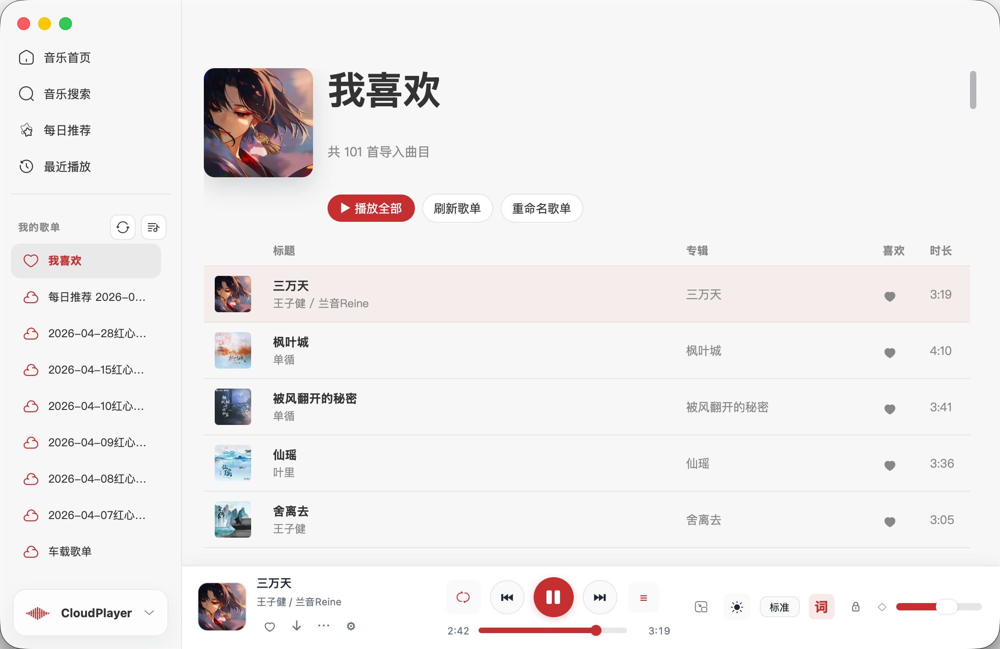
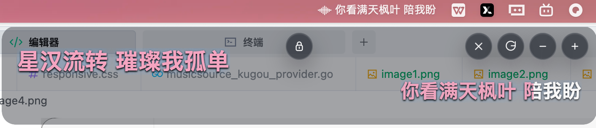

# CloudPlayer Wails

CloudPlayer Wails 是基于 Wails 3 的桌面音乐播放器，聚焦 macOS 桌面体验，同时保留在线曲库、歌词、下载、歌单导入、桌面歌词和快捷键等能力。

## 项目定位

- 基于 Wails 3 的桌面应用实现
- 与上游 Tauri 版本分离维护
- 当前重点是桌面端稳定性、结构整理和功能迁移

上游参考：

- Upstream 项目：`blackchoice/cloudplayer-tauri`
- Upstream 仓库：<https://github.com/blackchoice/cloudplayer-tauri>
- 当前参考基线：`blackchoice/cloudplayer-tauri@01ac13eada3b0e67f050e2cf79336e9c073f6959`
- Wails 版本：`github.com/wailsapp/wails/v3 v3.0.0-alpha.74`

## 项目截图

### 主界面


### 沉浸模式


### Mini 模式


### 歌单列表



### 桌面歌词与菜单歌词



## 功能概览

- 在线曲库搜索与播放
- 本地歌单、云歌单、导入歌单与播放信息补全
- 下载管理
- 歌词聚合、替换、缓存和桌面歌词显示
- 酷狗相关登录与歌单导入能力
- 在线模式：歌单、歌单内容和音乐源切到酷狗云端，并支持 12 小时缓存与手动刷新
- 播放状态持久化：播放队列、播放位置、歌曲时长和歌词进度可在重启后恢复
- 托盘、快捷键、窗口管理和主题设置

## 环境要求

- Go `1.25.0`
- Node.js 和 npm
- Wails 3 CLI

安装 Wails 3 CLI：

```bash
go install github.com/wailsapp/wails/v3/cmd/wails3@latest
```

确保 `wails3` 已经在命令行可用。

## 快速开始

1. 克隆仓库：

```bash
git clone https://github.com/lfhy/cloudplayer.git
cd cloudplayer
```

2. 安装前端依赖：

```bash
cd frontend
npm install
cd ..
```

3. 启动开发模式：

```bash
wails3 dev
```

如果希望使用项目内封装好的任务，也可以直接运行：

```bash
task dev
```

## 常用命令

开发模式：

```bash
wails3 dev
```

开发构建：

```bash
wails3 build DEV=true
```

前端开发构建：

```bash
cd frontend
npm run build:dev -q
```

Go 后端构建：

```bash
go build -o bin/codex-smoke-test .
rm -f bin/codex-smoke-test
```

Task 任务入口：

```bash
task dev
task build
task package
wails3 task release:desktop
```

桌面多平台发布包：

```bash
./scripts/build_desktop_packages.sh
```

默认会输出以下目标：

- `windows/amd64`
- `windows/arm64`
- `macos/amd64`
- `macos/arm64`

产物会整理到 `bin/releases/` 下，Windows 默认生成 NSIS 安装包，macOS 会保留 `.app` 并额外输出 `.zip` 归档。

常见示例：

```bash
# 只打 macOS 双架构
./scripts/build_desktop_packages.sh --targets macos/amd64,macos/arm64

# 只打 Windows 双架构
./scripts/build_desktop_packages.sh --targets windows/amd64,windows/arm64

# 同时额外生成 macOS universal 包
./scripts/build_desktop_packages.sh --include-macos-universal

# 只打印将执行的命令
wails3 task release:desktop:dry-run
```

Windows 打包前需要安装 `makensis`；如果在非 macOS 主机上构建 macOS 包，则还需要 Docker 和 `wails-cross` 镜像：

```bash
wails3 task setup:docker
```

## 目录结构

```text
.
├── main.go
├── backend/
├── frontend/
├── build/
├── bin/
└── Taskfile.yml
```

### Backend

后端已经按职责拆分，不再使用旧的 `internal/cloudplayer` 或 `backend/core/cloudplayer` 结构。

- `backend/app`
  Wails 应用壳层、生命周期、前端绑定入口和按功能拆分的服务方法。
- `backend/state`
  应用共享状态、播放状态和运行时上下文。
- `backend/cache`
  搜索、歌词等缓存能力。
- `backend/desktop`
  桌面歌词窗口、托盘和桌面相关能力。
- `backend/hotkeys`
  全局快捷键注册与调度。
- `backend/model`
  共享数据模型。
- `backend/config`
  本地配置和用户偏好持久化。
- `backend/db`
  SQLite 初始化、迁移和访问。
- `backend/download`
  下载任务调度和 provider 集成。
- `backend/lyrics`
  歌词解析、聚合、过滤、缓存。
- `backend/musicsource`
  在线曲库 provider 抽象和实现。
- `backend/importplaylist`
  导入歌单解析。
- `backend/importenrich`
  导入结果补全和 enrich 流程。
- `backend/sharelink`
  分享链接解析。
- `backend/httpclient`
  网络访问封装。
- `backend/systemproxy`
  系统代理能力。
- `backend/captcha`
  验证码相关支持。
- `backend/pjmp3`
  PJMP3 相关能力。
- `backend/ratelimiter`
  限流工具。

### Frontend

前端遵循“按类型优先，再按功能拆分”的组织方式：

- `frontend/src/app`
  应用入口、运行时接线和基础辅助模块。
- `frontend/src/pages`
  页面级结构。
- `frontend/src/components`
  通用组件。
- `frontend/src/features`
  按业务能力拆分的前端逻辑，例如 `player`、`lyrics`、`search`、`library`、`settings`、`download`。
- `frontend/src/windows`
  独立窗口逻辑，例如桌面歌词和换歌词窗口。
- `frontend/src/styles`
  按核心、布局、页面、窗口和组件拆分的样式。
- `frontend/src/wails`
  Wails 绑定与事件桥接。

## 开发约定

- 手写代码文件尽量保持单一职责，接近 300 行就继续拆分。
- 后端按功能拆 service 和 helper，不再堆在单个大文件里。
- 前端入口文件保持轻量，页面和窗口逻辑尽量下沉到模块。
- 构建产物不要写到仓库根目录，使用 `bin/` 或工具默认目录。
- 新增 feature 时，同步更新 `README.md`，保证功能说明与当前实现一致。

## 迁移说明

如果你看到旧文档、旧讨论或旧分支里提到下面这些路径，它们都已经过时：

- `internal/cloudplayer/...`
- `backend/core/cloudplayer/...`
- 根目录下的 `cloudplayer_service_*.go`

当前代码已经改为 `backend/*` 多包拆分结构。

## 交流

欢迎加入 QQ 群交流：`572532027`
