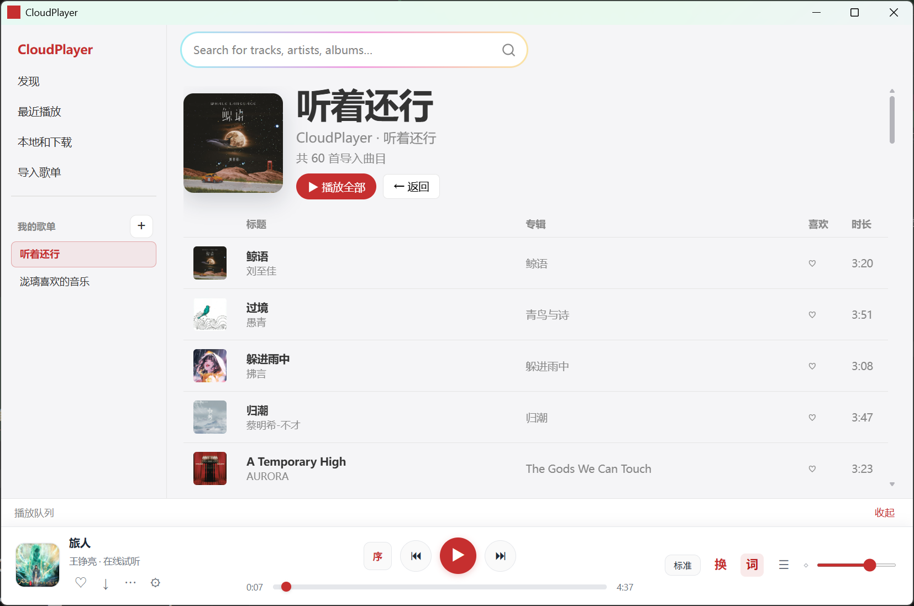

# CloudPlayer Tauri

**语言 / Languages：** **简体中文**（当前） | [English](README.en.md)

**快速跳转：** [项目简介](#sec-overview) · [核心特性](#sec-features) · [界面预览](#sec-preview) · [环境与依赖](#sec-deps) · [开发与构建](#sec-build) · [本地发布](#sec-release-local) · [GitHub Release](#sec-github-release) · [发布检查清单](#sec-checklist) · [致谢](#sec-ack)

<a id="sec-overview"></a>

CloudPlayer 是一个基于 Tauri、Rust 与 Vite 构建的桌面音乐应用。项目围绕桌面端音乐检索、在线试听、多源歌词获取、本地曲库管理、下载队列与歌单导入等能力展开，适用于日常播放与本地整理场景。

<a id="sec-features"></a>

## 核心特性

- **桌面应用架构**：基于 Tauri 2 与系统 WebView 实现，在保持桌面应用体验的同时兼顾较小体积与较快启动速度。
- **搜索与播放能力**：支持全局搜索、在线试听与本地播放。
- **多源歌词链路**：按 **QQ 音乐 → 酷狗 → 网易云 → LRCLIB** 的顺序回退，优先返回逐字歌词；其中 QQ QRC 支持自定义 3DES 解密与解析。
- **可选网易云接口**：支持配置自托管网易云接口，并优先使用 `lyric/new` 获取 YRC 逐字歌词。
- **本地数据管理**：基于 SQLite 管理本地曲库、歌单与最近播放记录。
- **下载任务队列**：支持后台下载音频资源并写入本地。
- **分享链接导入**：支持从网易云音乐与 QQ 音乐分享链接导入歌单内容。
- **托盘与桌面歌词**：提供系统托盘能力，并支持桌面歌词窗口及样式同步。

<a id="sec-preview"></a>

## 界面预览

<p align="center">
  
</p>

---

<a id="sec-deps"></a>

## 环境与依赖

### 前端依赖

- `vite`
- `@tauri-apps/cli`
- `@tauri-apps/api`
- `@tauri-apps/plugin-dialog`

### 后端依赖

`src-tauri/Cargo.toml` 中使用的主要依赖如下：

- `tauri`, `tauri-build`, `tauri-plugin-dialog`
- `tokio`, `reqwest`, `rusqlite`, `serde`, `serde_json`
- `walkdir`, `regex`, `url`, `image`, `imageproc`, `rand`, `chrono`

### 依赖检查命令

```bash
npm install
npm outdated
cargo check --manifest-path src-tauri/Cargo.toml
```

---

<a id="sec-build"></a>

## 开发与构建

### 环境要求

- Node.js 18 及以上版本，建议使用 LTS
- npm
- Rust stable toolchain
- Windows 环境下需预先安装 Tauri 运行与构建所需组件，例如 WebView2 与 MSVC Build Tools

建议先确认本地工具链版本：

```bash
node -v
npm -v
rustc -V
cargo -V
```

### 开发模式

```bash
npm run dev
npm run tauri dev
```

### 前端生产构建

```bash
npm run build
```

前端构建产物默认输出至 `dist/`，并由 Tauri 配置中的 `frontendDist: ../dist` 引用。

---

<a id="sec-release-local"></a>

## 本地发布

当前 `src-tauri/tauri.conf.json` 中的打包配置如下：

```json
"bundle": {
  "active": true,
  "targets": "nsis"
}
```

以上配置表示当前已启用打包，且默认安装包目标为 `nsis`。

执行本地发布构建：

1. 确认前端依赖与 Rust 工具链已安装完成。
2. 执行以下命令：

```bash
npm run tauri build
```

构建产物通常位于：

- `src-tauri/target/release/`
- `src-tauri/target/release/bundle/`

---

<a id="sec-github-release"></a>

## GitHub Release

以下流程用于将安装包上传至 GitHub Release 页面。

### 1. 版本准备

发布前请同步更新以下版本号：

- `package.json`
- `src-tauri/Cargo.toml`
- `src-tauri/tauri.conf.json`

建议使用 `v0.1.0` 形式的 tag。

### 2. 生成发布产物

```bash
npm run tauri build
```

构建完成后，可从 `src-tauri/target/release/bundle/` 收集发布产物，例如 `.msi`、`.exe` 等安装包文件。

### 3A. 通过 GitHub 网页创建 Release

1. 推送提交与 tag：

```bash
git add .
git commit -m "release: v0.1.0"
git tag v0.1.0
git push origin master --tags
```

2. 打开仓库并进入 **Releases**。
3. 选择 **Draft a new release**。
4. 选择 tag `v0.1.0`。
5. 上传 `src-tauri/target/release/bundle/` 中的安装包文件。
6. 发布 Release。

### 3B. 使用 GitHub CLI 创建 Release

```bash
gh release create v0.1.0 ^
  "src-tauri/target/release/bundle/**" ^
  --title "v0.1.0" ^
  --notes "CloudPlayer v0.1.0 release"
```

若当前 shell 不支持通配符上传，请改为显式传入各个文件路径。

---

<a id="sec-checklist"></a>

## 发布检查清单

- 已执行 `npm install`
- 已通过 `cargo check`
- `bundle.active = true`
- 版本号已完成同步
- 已验证 `npm run tauri build` 产物
- 已创建并推送 Git tag
- GitHub Release 已发布且包含安装包

---

<a id="sec-ack"></a>

## 致谢

QQ 音乐 QRC（包括自定义 Triple-DES 解密与 QRC 正文解析等能力）的实现参考了以下开源项目，特此致谢：

- **[LDDC](https://github.com/chenmozhijin/LDDC)**（Lyric Downloader）：`tripledes.py` 中的非标准 3DES 与相关解析思路。
- **[QQMusicDecoder](https://github.com/WXRIW/QQMusicDecoder)**：LDDC 所引用的上游 C# 实现（如 `DESHelper.cs`、`Decrypter.cs`），为理解 QQ 音乐非标准格式提供原始参考。

若基于本项目继续维护、分发或二次开发，请遵守上述项目各自的许可证要求，例如 LDDC 的 GPL-3.0。
