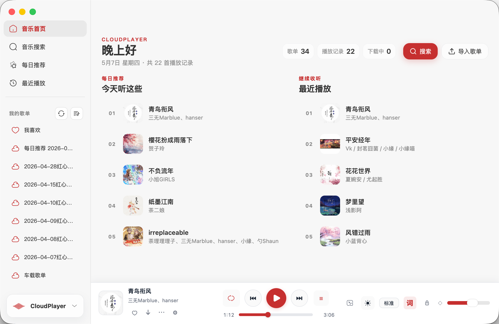

# CloudPlayer Flutter

CloudPlayer Flutter 是 CloudPlayer 的 Flutter 客户端仓库，当前沿用旧 `cloudplayer-wails` 的 Go 后端能力，通过 Flutter 重建主界面与播放器交互。现阶段仍以 macOS / Windows 桌面体验为主，同时已经补齐 Android 平台工程、移动端播放器体验和 Android 发布链路。

## 下载使用

- 当前 Flutter 版仓库已经补齐 `v*` tag 触发的 GitHub Actions 发布流，可产出 `macOS amd64 / arm64 / universal` 的 `zip + dmg`、`Windows amd64` 的 `zip + installer.exe`，以及 `Android arm64-v8a` 的 release `apk`。
- 发布入口位于 [`.github/workflows/release-desktop.yml`](./.github/workflows/release-desktop.yml)，推送版本标签后会并行构建各平台产物，并在同一条发布流里统一汇总到 GitHub Release。
- macOS 本地开发和构建依赖完整 `Xcode.app`，如果系统默认 `xcode-select` 仍指向 Command Line Tools，请显式指定 `DEVELOPER_DIR=/Applications/Xcode.app/Contents/Developer`。
- 当前仓库更偏向开发中的 Flutter 重构版本；如果你只是想直接使用成熟版本，建议同时关注旧 Wails 版仓库的 release 节奏。

## 功能概览

- 在线曲库搜索与播放。
- 首页、搜索、每日推荐、最近播放、歌单、导入、设置、下载管理等主页面已经接通。
- 歌单、每日推荐、最近播放和搜索结果复用统一曲目表格，支持点击歌手名或专辑名直接发起搜索。
- 曲目列表和底部播放区支持直接切换「我喜欢」，并同步内建歌单状态。
- 歌单详情支持批量模式，可多选并从当前歌单移除。
- 本地歌单、导入歌单、每日推荐保存为歌单，以及导入后补全播放信息。
- 导入流程已接通本地目录、分享链接、纯文本和酷狗歌单导入。
- 播放状态持久化已经恢复，播放队列、当前曲目、播放位置和时长可在重启后继续恢复。
- 沉浸模式、同窗口 `Mini` 模式和 macOS 原生桌面歌词已经接回。
- 桌面歌词已恢复旧版时间锚点和逐字高亮语义，逐字插值由 macOS 原生层完成。
- 偏好设置支持亮色 / 暗色主题切换、桌面歌词颜色设置和常用播放偏好。
- macOS 托盘已恢复左键显示主界面、右键菜单播放控制，以及跟随主题变化的默认封面占位。
- Windows 平台工程已经补齐，桥接层和发布脚本可直接参与 Windows 构建。
- Android 平台工程已经加入仓库，并已接通 Go bridge `.so` 打包与真实业务启动链路；桌面窗口、托盘和桌面歌词逻辑会在移动端安全降级。
- Android 移动端首页、底部浮岛导航、沉浸播放器和系统音量联动已经接入，移动端布局不会再复用桌面端的底栏交互。
- Android 根页面现在会在系统返回键时弹出“最小化到后台 / 退出应用”，二级页面仍优先按当前页面状态回退；沉浸播放器也会额外避开系统导航栏与状态栏安全区。
- Android 现在已接入系统 media session、通知栏播放控制和媒体按键；应用最小化到后台后播放不会中断，锁屏/通知栏可直接控制上一首、播放暂停和下一首。
- 文件目录选择链路已经切到 Flutter 官方 `file_selector`，Android 发布构建不再依赖 `file_picker`；移动端导出歌单时会在系统不支持“另存为”弹窗的场景下自动落到应用导出目录。
- 云端「我喜欢」歌单详情页现在会在进入页面和点击红心后即时同步一次，新的云收藏会自动补进列表，并同步修正曲目红心状态。
- 设置页已预留 `歌曲海源` 渠道选项，并接通 provider key / sourceId 命名空间与后端 provider 占位；实际搜索、试听和歌词抓取链路仍待后续补齐。

## 当前状态

- Flutter 前端位于 `lib/`，Go 业务后端位于 `backend/`，两者通过 `bridge/` 下的 `c-shared` 动态库桥接。
- Android 端已经切到真实应用启动路径，播放、搜索、歌单、设置等能力通过打包进 APK 的 Go bridge `.so` 提供。
- GitHub Actions 现在会在 Linux runner 上安装 Android NDK，构建 `arm64-v8a` Go bridge，并输出 Android release APK。
- 当前主验证路径是 macOS，仓库规则要求最终集成验证使用 `flutter run -d macos`。
- 旧 Wails 版的大部分核心使用路径已经迁入，但下载实时事件流、部分子窗口流程和若干细节交互仍在继续补齐。

## 开发指南

### 环境要求

- Flutter 3.44+
- Go 1.23+
- macOS 可用的完整 Xcode.app
- CocoaPods
- Android 本机调试代理建议放在仓库根目录 `.env.local`；`make android-emulator` 和 `make android-run` 会自动加载它。

### 常用命令

```bash
make bridge
make android-bridge
make smoke
make analyze
make test
make run
make android-emulator
make android-run
flutter analyze
dart run tool/bridge_smoke.dart
go test ./...
DEVELOPER_DIR=/Applications/Xcode.app/Contents/Developer flutter run -d macos
```

其中：

- `make bridge` 会默认重建 macOS 通用版 Go `c-shared` bridge 动态库。
- `make android-bridge` 会在加载 `~/.zshrc` 与 `.env.local` 后自动探测本机 NDK `prebuilt` host tag，构建 `arm64-v8a` 版 Go `c-shared` bridge，并同步到 Gradle `jniLibs` 输入目录。
- `make bridge-universal` 会分别构建 `arm64` / `amd64` bridge，并用 `lipo` 合成 macOS 通用动态库。
- `make smoke` 会重建 bridge，并输出动态库路径、媒体代理基址和数据库状态。
- `make analyze` 会执行 `flutter analyze`。
- `make test` 会执行 `go test ./...`。
- `make run` 会先重建 bridge，再启动 Flutter macOS 桌面端。
- `make android-emulator` 会加载 `~/.zshrc` 和仓库根目录 `.env.local`，必要时自动启动并等待 `CloudPlayer_API_36` 模拟器可用。
- `make android-run` 会加载 `~/.zshrc` 和仓库根目录 `.env.local`，先构建并同步 Android bridge `.so`，再自动复用已启动的 Android 模拟器或拉起默认模拟器进入 debug 会话。
- `scripts/build_android_release.sh` 会在无交互环境下构建 Android `arm64-v8a` bridge，并输出 release `apk`，供 GitHub Actions 发布流使用。

### 目录结构

- `backend/`: 复用旧版 CloudPlayer 的 Go 业务实现。
- `bridge/`: Go `c-shared` 桥接层，导出给 Dart FFI 使用。
- `lib/`: Flutter 页面、状态管理、播放器、主题和窗口逻辑。
- `macos/Runner/`: macOS 原生窗口、托盘、桌面歌词等平台侧实现。
- `android/`: Android 原生工程与 Flutter Android embedding 入口。
- `tool/bridge_smoke.dart`: Dart 直连 Go bridge 的 smoke 验证脚本。
- `scripts/`: 发布和打包辅助脚本。

## GitHub 发布

- 推送 `v*` tag 后，GitHub Actions 会触发一条聚合发布工作流，并行构建 `macOS amd64`、`macOS arm64`、`macOS universal`、`Windows amd64` 和 `Android arm64-v8a` 产物。
- macOS 每个目标都会产出对应架构的 `zip + dmg`；Windows 会产出 `amd64` 的 `zip + installer.exe`；Android 会产出 `arm64-v8a` 的 release `apk`。
- 所有成功构建出的资源会在最后一个 `publish` job 里统一汇总并发布到同一个 GitHub Release；也可以手动触发 workflow，并传入 `tag_name` 发布指定标签。

## 项目截图

### 主界面



## 当前限制

- 当前 Flutter 版仍在持续对齐旧 Wails 版的细节体验，部分子窗口流程和边角交互还没有完全做到 1:1。
- Android 端当前仅打包 `arm64-v8a` bridge；如果后续需要 x86_64 模拟器或发布多 ABI，需要继续扩展 Android NDK 构建矩阵。
- Android GitHub Actions 发布流当前仅产出 `arm64-v8a` release APK；如果后续需要 `aab`、多 ABI 或正式签名，需要继续扩展发布脚本与密钥注入流程。
- `歌曲海源` 当前只完成了 provider 选择、sourceId 前缀和后端占位接入；搜索、播放地址解析、歌词与收藏链路尚未落地。
- Android 模拟器音频链路目前已在应用层对 `media_kit/mpv` 的默认 `OpenSLES` 输出做 emulator 绕过，优先切到 `AudioTrack`；真实设备侧仍建议继续做一次实机听感回归。
- Android 端导出文本 / CSV 当前会在应用私有导出目录落盘，不会弹出系统级“另存为”窗口；如果后续需要共享到公共目录，可以继续补系统分享或 SAF 写入链路。
- 下载管理目前仍以前端镜像队列为主，旧版下载实时事件流尚未完整接回。
- 桌面歌词已经迁到 macOS 原生浮层，但围绕歌词的个别旧版独立窗口流程还没有全部恢复。

## 交流群

QQ群：`572532027`
## Windows Packaging Notes

- The Flutter desktop shell now embeds `SourceHanSansSC` from `assets/fonts/` so Windows and macOS share the same bundled UI typeface instead of relying on different system fonts.
- Windows runner icon generation is now standardized on the shared app icon asset. Run `powershell -ExecutionPolicy Bypass -File .\scripts\generate_windows_icon.ps1` after replacing the app icon source if you need to refresh `windows/runner/resources/app_icon.ico`.
- The Windows desktop shell intentionally keeps the native title bar in dev and release builds, and the sidebar now blends directly into the title-bar transition area with a transparent gradient instead of introducing a separate hard divider.
- Windows installers now bundle the Microsoft Visual C++ runtime and install it automatically when the target machine is missing it.
- The Windows bridge startup path now skips Wails-only window theme sync when running under the Flutter FFI host, which prevents a native crash during settings persistence.
- For local Windows development, run `powershell -ExecutionPolicy Bypass -File .\scripts\dev_windows.ps1` to apply the expected proxy settings, rebuild the Go bridge, and launch `flutter run -d windows`. Add `-UseCnMirror` only when you explicitly want Flutter and pub downloads to use the domestic mirror endpoints.
- If you prefer double-click startup on Windows, use `.\scripts\dev_windows_double_click.cmd`.
